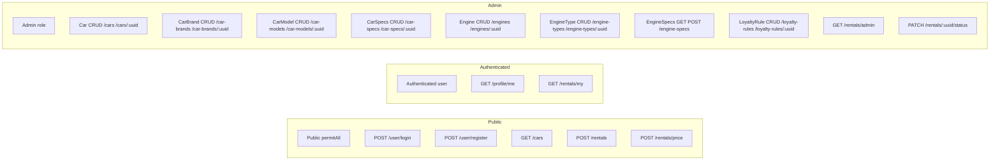

# API Endpoints Schema

Компактная схема endpoint-ов приложения (Spring Boot), сгруппированная по уровню доступа.

## Visual map (Mermaid)

## Public + Authenticated

| Access | Method | Path |
|---|---|---|
| `permitAll` | POST | `/user/login` |
| `permitAll` | POST | `/user/register` |
| `permitAll` | GET | `/cars` |
| `permitAll` | POST | `/rentals` |
| `permitAll` | POST | `/rentals/price` |
| `authenticated` | GET | `/profile/me` |
| `authenticated` | GET | `/rentals/my` |

## Admin (`ROLE_ADMIN`)
| Resource | GET              | POST | PUT/PATCH               | DELETE                 |
|---|------------------|---|-------------------------|------------------------|
| `/cars` | `/cars` | `/cars` | `/cars/{uuid}`          | `/cars/{uuid}`         |
| `/car-brands` | `/car-brands`    | `/car-brands` | `/car-brands/{uuid}`    | `/car-brands/{uuid}`   |
| `/car-models` | `/car-models`    | `/car-models` | `/car-models/{uuid}`    | `/car-models/{uuid}`   |
| `/car-specs` | `/car-specs`     | `/car-specs` | `/car-specs/{uuid}`     | `/car-specs/{uuid}`    |
| `/engines` | `/engines`       | `/engines` | `/engines/{uuid}`       | `/engines/{uuid}`      |
| `/engine-types` | `/engine-types`  | `/engine-types` | `/engine-types/{uuid}`  | `/engine-types/{uuid}` |
| `/engine-specs` | `/engine-specs`  | `/engine-specs` | `/engine-specs{uuid}`   | `/engine-specs{uuid}`  |
| `/loyalty-rules` | `/loyalty-rules` | `/loyalty-rules` | `/loyalty-rules/{uuid}` | `/loyalty-rules/{uuid}` |

### Special admin endpoints

| Method | Path | Purpose |
|---|---|---|
| GET | `/rentals/admin` | Admin list of rental orders |
| PATCH | `/rentals/{uuid}/status` | Update rental order status |

---
